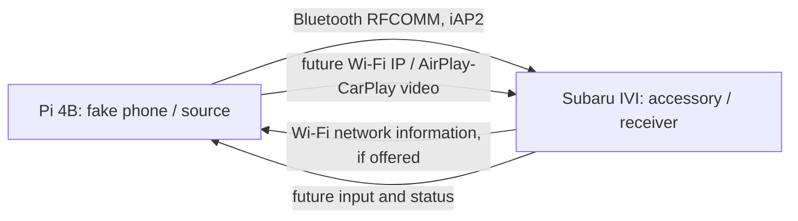
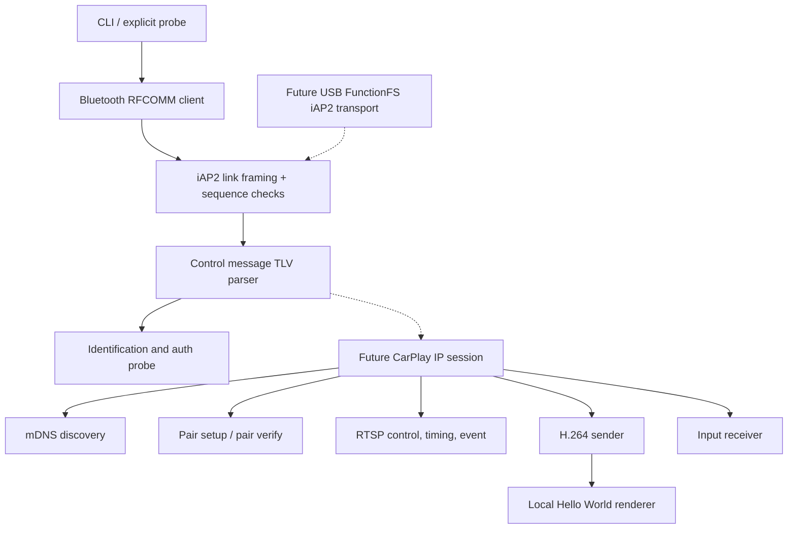

# Architecture and role

The Raspberry Pi must act as the **phone / iPhone / CarPlay source**. The Subaru is the **accessory / head unit / receiver**. Many public projects implement the reverse direction (iPhone → Pi); their working receiver paths cannot be presented as proof of a Pi → Subaru source.

The current executable includes the solid boxes from CLI through auth probe, plus an independent frame/encoder demo. The auth probe stops before asserting `AuthenticationSucceeded` because certificate-chain and challenge-response verification are missing. Wi-Fi credentials are never persisted. The config keys `store_wifi_credentials` and `log_payloads` reserve policy space but do not enable any secret logging or storage in this milestone.

## Checkpoint sequence

1. **Implemented, hardware unverified:** Bluetooth target/service selection, RFCOMM, iAP2 marker and bounded SYN/ACK framing, control-session TLVs, identification request/response/accept, certificate and challenge-response requests. Authentication response is received but *unverified*.
2. **Next:** independently validate the accessory's MFi certificate chain and its signature against a random challenge using distributable trust material and a reviewed implementation. Only then send `AuthenticationSucceeded` and record `auth verified`.
3. **Next:** request `AccessoryWiFiConfigurationInformation` (`0x5702`), parse `0x5703`, redact passphrase, and join the network only through an explicit opt-in command. Observe how the Subaru presents Wi-Fi and whether a CarPlay endpoint becomes discoverable.
4. **Next:** determine actual mDNS role/service (`_airplay._tcp`, `_raop._tcp` or CarPlay-specific advertisement), endpoint ownership and network address from a lawful capture. Establish pair-setup / pair-verify, RTSP setup, timing and event channels. Generic AirPlay mirroring behavior is a reference, not a guarantee of CarPlay compatibility.
5. **Next:** negotiate display geometry and H.264 profile/level, encrypt/packetize and send frames with correct timing. Receive input/status. The exact **missing boundary** is authenticated CarPlay sender-side IP session and SETUP plus encrypted stream formatting; a raw `.h264` file cannot be sent directly to a Subaru display.

## USB later

The Pi 4's USB-C controller supports gadget mode under `dwc2` per [Raspberry Pi's OTG guide](https://pip-assets.raspberrypi.com/categories/685-app-notes-guides-whitepapers/documents/RP-009276-WP/Using-OTG-mode-on-Raspberry-Pi-SBCs); check `/sys/class/udc` and `scripts/check-usb-gadget.sh` on the actual OS/kernel. Linux [ConfigFS gadget documentation](https://docs.kernel.org/usb/gadget_configfs.html) covers explicit gadget creation; FunctionFS can provide userspace endpoints and `ncm` a CDC-NCM network function. The iAP2 USB transport, descriptors, role-switch sequence, and whether the vehicle's USB port accepts this role need device traces. The Pi must be powered separately via a suitable data/power split arrangement during development. Do not connect competing power sources blindly. No Apple VID/PID spoofing or persistent `dtoverlay=dwc2` edit is performed. A future explicit `carpi usb setup` / `teardown` should own its ConfigFS state and verify descriptor legality before binding a UDC.
