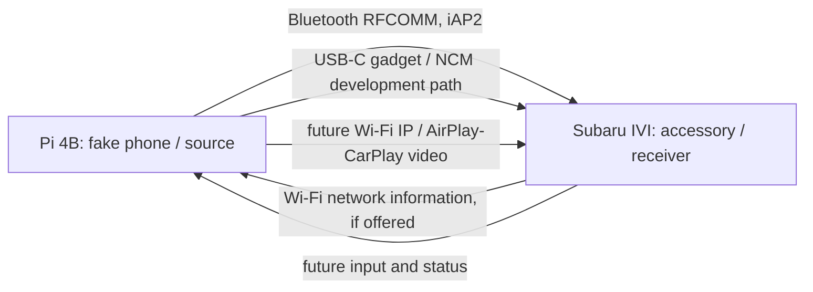
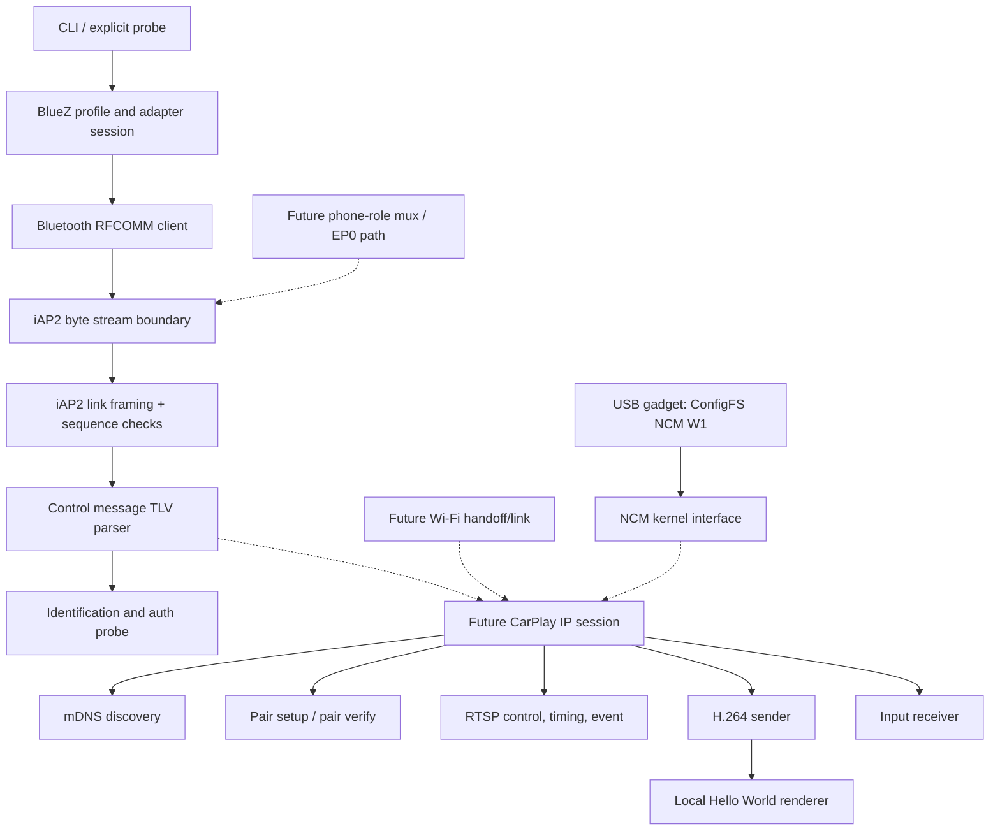

# Architecture and role

The Raspberry Pi must act as the **phone / iPhone / CarPlay source**. The Subaru is the **accessory / head unit / receiver**. Many public projects implement the reverse direction (iPhone → Pi); their working receiver paths cannot be presented as proof of a Pi → Subaru source.

The [GPIO UART console](uart-console.md) is the primary developer connection to the Pi for commands and test output. It connects to a development computer and is separate from the Bluetooth, Wi-Fi, and USB links under test.

The current executable includes a temporary BlueZ local iAP2 server profile, the outgoing Bluetooth probe, the stream boundary, and an independent USB NCM development gadget. The local profile rejects unexpected inbound streams pending vehicle evidence. There is no phone-role mux endpoint, wired iAP2 session or CarPlay IP sender. The auth probe stops before asserting `AuthenticationSucceeded` by default because certificate-chain and challenge-response verification are missing. The explicit `--allow-unverified-accessory` research flag sends it without claiming verification, then requests a Wi-Fi configuration message. Wi-Fi credentials are never persisted or displayed in full. The config keys `store_wifi_credentials` and `log_payloads` reserve policy space but do not enable any secret logging or storage in this milestone.

## Checkpoint sequence

1. **Implemented, hardware unverified:** local BlueZ iAP2 profile registration, reversible adapter setup, Bluetooth target/service selection, RFCOMM, iAP2 marker and bounded SYN/ACK framing, control-session TLVs, identification request/response/accept, certificate and challenge-response requests. Authentication response is received but *unverified*.
2. **Research-only opt-in, hardware unverified:** send `AuthenticationSucceeded` after a structurally valid response without claiming verification; request `AccessoryWiFiConfigurationInformation` (`0x5702`), parse `0x5703`, display SSID and redact passphrase. No network join is implemented.
3. **Next:** independently validate the accessory's MFi certificate chain and its signature against a random challenge using distributable trust material and a reviewed implementation. Only then record `auth verified`.
4. **Next:** determine actual mDNS role/service (`_airplay._tcp`, `_raop._tcp` or CarPlay-specific advertisement), endpoint ownership and network address from a lawful capture. Establish pair-setup / pair-verify, RTSP setup, timing and event channels. Generic AirPlay mirroring behavior is a reference, not a guarantee of CarPlay compatibility.
5. **Next:** negotiate display geometry and H.264 profile/level, encrypt/packetize and send frames with correct timing. Receive input/status. The exact **missing boundary** is authenticated CarPlay sender-side IP session and SETUP plus encrypted stream formatting; a raw `.h264` file cannot be sent directly to a Subaru display.

## USB milestone

The Pi 4's USB-C controller supports gadget mode under `dwc2` per [Raspberry Pi's OTG guide](https://pip-assets.raspberrypi.com/categories/685-app-notes-guides-whitepapers/documents/RP-009276-WP/Using-OTG-mode-on-Raspberry-Pi-SBCs). `carpi usb setup` now binds a ConfigFS NCM gadget for PC enumeration testing; `teardown` removes it. Host-visible descriptors and kernel support still need Pi validation. [Wired research](wired-usb-research.md) explains why ConfigFS alone cannot implement the observed iPhone configuration reveal or mux. The existing local renderer/encoder remains the video source for a future shared IP sender.
